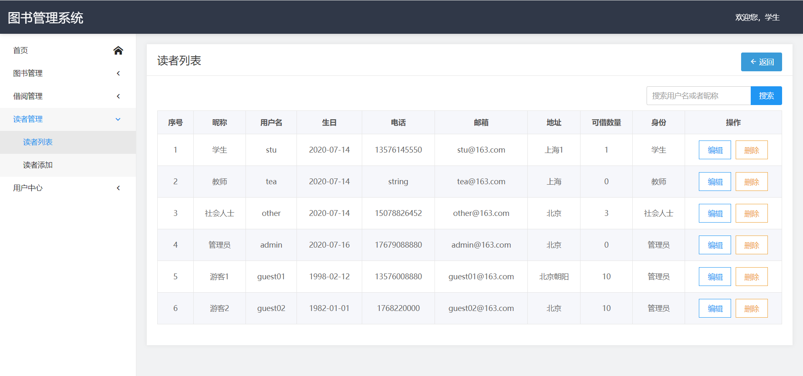

#### 介绍
    图书管理系统

#### 软件截图
swaggerapi接口文档：

登录页：

首页：

图书列表：

添加图书：

搜索图书：

借阅图书：

归还图书：

读者列表：

读者添加：

个人信息：

用户管理：

添加用户：

#### 软件架构
软件架构说明:

##### 后端：
- 基础框架： SpringBoot
- 数据库： H2
- 复杂数据操作： Mybatis
- 安全框架： SpringSecurity
- 模板引擎： Thymeleaf
- API文档&测试： Swagger2

##### 前端：
- javaEx,
- jQuery 

#### 安装教程
1. 本地搭建好java1.8环境
2. 配置maven, 等待依赖下载完成
3. 启动访问http://localhost:8081 即可到达登录页
4. 方便测试，密码明文存储。账号：【学生： stu/123】【教师： tea/123】【其他：other/123】【管理员：admin/123】
5. 登录H2数据：http://localhost:8081/h2，账号/密码：root/root;
6. JDBC URL: jdbc:h2:F:/H2/db/db02（没有F盘，可自行更改H2存储地址）

7. 如果没有数据，则执行建表语句和插入数据：
   src/main/resources/db/schema-h2.sql
   src/main/resources/db/data-h2.sql
8. admin账号有管理权限，可查看所有功能，可授权和创建用户
9. swagger2接口地址，http://localhost:8081/swagger-ui.html
10. 系统配置环境设置dev
